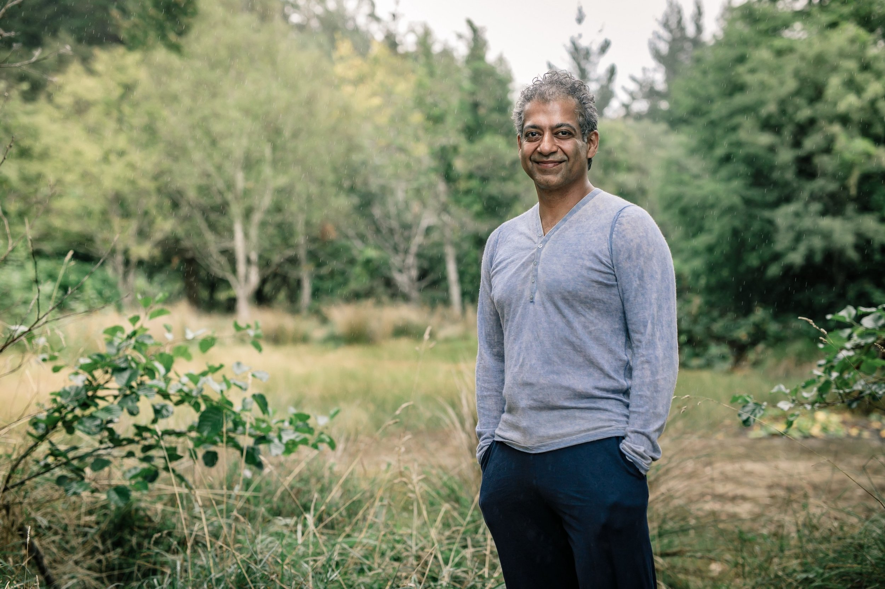

#  The Man
Today's blog, is about a book that I really enjoyed reading. it's a relatively thin book but it's really rich with wisdom. 

 Wisdom that **Naval Ravikant** acquired during his long career as an entrepreneur and an angel investor. 

The book format is quiet original, it's a recollecion made by Eric Jorgenson of Naval’s thoughts and ideas from Twitter, Podcasts, and Essays over the past decade.
You can get the pdf version of the book for free in the [Naval's website](https://www.navalmanack.com/).

The next part is a little summary I've done after reading his book, you can take a peek at it before diving into the book yourself.

# II) Part  1: Wealth

- Building wealth is not really about hard work
    - Hard work need to be directed in the right way
    - The most important part is to know where to direct it

 

- Fortune requires leverages
    - Capital
    - Human ressources
    - Products with no marginal costs( no cost for producing more )
        - **Code/Media**
- All the returns in life, whether in wealth, relation- ships, or knowledge, come from compound interest
- Accountability and the ability to take risk under your own name is key to get credibility which is necessary to get capital or labor
- **You’re never going to get rich renting out your time.**
    - We lived in societies where leverage didn’t exist 8h chopping wood for you will always be equal to 8 hours
    - One should always previlege independence rather than pay to be accountable on your ouput and not the input
    - What’s great about the new type of leverages (code media) is that it’s permissionless
        - You don’t need anyone permission to use the leverage, as opposed to capital or labor
- Spend more time taking the big decisions
    - Where you live
    - Who you’re with
    - What to do
    
- With specific knowlegde, accountability and leverage you’ll get what you deserve
    - Your life’s resume is a catalog of the hardships you’ve lived
        - On your deathbed you’ll reminisce about the struggles and how you overcome them
    
- **To get rich, you have to be a high-stress high-anxiety hard working person**
- **Money will not make you happy**
    - It will remove from your way some stuff that could stop you from being happy
    - It will give you freedom in the material world, it’s not gonna make you family great and solve your health problems..
- Let’s get you rich first
    - Buddha was a prince before going to the wood
    - Once you have the freedom and the energy you can pursue your own peace of mind and happiness

## 2. Building Judgment

- Hardwork is way overrated compared to judgment
- Wisdom is knowing what are the long term consequences of your actions
- Judgment is applying wisdom to external problems: knowing the long term consequences of your actions and make the right decision  to capitalize on it
- Being  smart is being able to explain concepts to children without using fancy words
- Reading a book and being confused is comparable to going to the gym
    - my brain is being overwhelmed because it work on the edge of it capabilities (close to failure)
- Our minds will always respond with emotions about how the world  should be
    - One definition of suffering is seeing  things as exactly how they are
    - The good news is that the moment of suffering is a moment of truth, you are forced to accept reality as it is
    - To improve you have to based it on truth
    - **The difficult part is to see the truth, for that you have to put your ego out of the way**
    - What causes the pain is not the reality it’s conflit between the desire of the person and reality
    - The most desire I have for something to work out the less tendancy I will have to see the facts
    - Suffering the long run can have some impact on your ego and identity
        - An athlete who got badly injured have to accept that being an athlete does not constitute 100% of his identity
- **Praise specifically Criticize generally: the egos will work for you and not against you**
    - Criticize the approach or the class of activity
        - Se lamenter sur son sort n’est pas une bonne chose
    - Praise the person directly
- Always prefer short time pain and long time benefit if you have the choice
    - Long time benefits compound
    - In case of two roads that relatively equal but one is short time pain and long time benefit choose the short time pain even if your brain is wired to prefer short time benefits

# II) Part  2: Happiness

 

## Happiness is learned

> We are highly judgmental survival and replication machines with a lot of desires
> 
- Happiness is when nothing is missing, when you mind stop searching into the past or the future
- People tend to think that happiness is solely related to having positif thoughts
    - It’s untrue because every positive thought holds within in a negative one
        - When I say I’m happy it means that I was unhappy at another moment, if attractive it means that someone else is unattractive
    - *You have to view the negative so you can enjoy the positive*
    
    ## Happiness is a choice
    
- Happiness is a choice because reality has no concept of happiness, a tree does not know that.
    - *You live and get to experience a whole of  sensory stimulations and the way your interpret it is up you*
- You can’t be happy if you consider yourself as the most important thing in the universe
    - How can you when the universe does not bend to satisfy your own will
- Life is a blink of a firefly in the dark, it’s your responsability to use every  precioud second available in this world to make sure you are happy and interpreting well the stimulations

> Memory and identity are burdens in the past preventing us from living freely in the present
> 

## Happiness requires presence

> What if this lise is the paradise that we are promised we are squandering it ?
> 
- **When you walkind down the streets, only a small percentage of your brain is focused on the present. the rest is planning the future or regretting the past.**
    - This can ruin your happiness and stop you from enjoying the beauty of the moment and being grateful for where you are
    - Don’t spend your time living in delusions of the future
    

## Happiness requires peace

> A happy person isn’t someone who’s happy all the time but someone who effortlessly interprets events in such a way they don’t disturb his innate peace
> 
- A lot of anxiety comes from that fact that our minds are always searching for the next things and then next thing
    - You can’t sit by yourself doing literally nothing, because your anxiety always catchs you and pushes you to get up and go, get up and go
    - This can ruin your happiness and stop you from enjoying the beauty of the moment and being grateful for where you are
    - Don’t spend your time living in delusions of the future
    

## Every desire is a choose unhappiness

> The fundamental mistake is thinking that is something out there that can make you forever happy and fulfilled
> 
- The most common mistake in humanity is thinking that external circumstances  can make you happy
    - I’m waiting for a care to be delivered, and while the car is being shipped I visit all the forums on the internet. but the second it comes you stop caring about it
        - It’s not about the car, I know it’s a silly object. It’s really about being addicted to desire. I’m addicted to external thing bringing some kind of happiness or joy
- **The fundamental mistake is to always think I will be happy when I have…**

> **Desire is a contract you make with yourself to be unhappy until you satisfy it**
> 
- Choose your desired well then
- It’s way more important to perfect your desires than try to do something you don’t desire 100%
- When you’re young you’re healthy and can do a lot of things, this make you desire a lot which hinders your happiness. Older people are less healthy but happier
- Health, Time and money is the trifecta that every person is searching to have at once
    - By the time people get money, they realise that they lost time and health

> You have two lives, and the second one starts when you realize that you only have one  *Confucius*
> 

 

## Envy is the enemy of happiness

> One instinct that evolution has driven into us is our need for hierarchy. This is our ego, status, standing, reputation and where we are in the pecking order. We want the praise and acceptance of our peers. We crave admiration of those we see as our peers and [feel envy](https://fs.blog/2016/08/mental-model-bias-envy-jealousy/) when others seem to have more than us.
> 
- Life is purely a single player game, you’re born alone, you’re going to die alone and all of your interpretations, memories. You’re gone in 3 generations, no one cared before you showed up and no one will after
    - One aspect why meditation and yoga are hard is that they intrinsically one player activities
- Every good score card is internal : Warren Buffet
    - When you have a inner score card no one can define success but you
- Don’t jealous someone when you are not willing to swap every aspect of his life with yours

## Happiness is build by habits

> You are the combination of habits and people you spent the most time with
> 
- Happiness is a skill and it can be increased when you put your focus and intention into it
- Happiness is a trial and error type of skill
    - You literally have to try a lof of things to see what works for you
- You should replace your thoughtless bad habits with ones that increase your long term happiness and suround your self with low maintenance positive people
    - “Five Chimps theory” : you can predict the behaviour of a chimp according to the 5 chimps it spends the most time with

### Happiness habits:

- Meditation and trying to understand how your mind works
- Stop being judgmental and try to see positive aspects
    - When you judge you fill good for an instant feeling better than someone but it make you see negativity everywhere and the world reflects it back to you
- Get more sun exposure
- When you catch yourself desiring ask your self : is it worth to be unhappy until i get it ?
- Working out; when you have peace of body it’s easier to have peace of mind
- The less secrets you have the happier you will be
- In a downfall use meditation, working out and music to reset your mood and then choose a new path in which you’ll invest the rest of the day
- Be aware that **hedonic treadmill effect( going back to same level  of happiness infinitely)**  is stronger when it comes to physical stuff

 

## Happiness is in acceptance

> The struggle of
> 
- Faced with a situation you only have 3 choices
    - **Change it**
        - if you wanna change it, it becomes a desired and you’ll be unhappy until you do
        - Don’t pick too many of those because it requires a lof of motivation and purpose
    - Leave it
    - Accept it
    - **Whatever you do, the worst option is to sit around wishing you would change it and not change it,  wish you can leave it and not accept it**
- Acceptance is to be okay with whatever outcome you get, it’s to step back and see the grander scheme of things
    - We don’t alway get what we want but the sooner we accept it the soon we can adapt to it
    
    ### Acceptance hacks:
    
    - **To step back and look at previous moment of hardship and suffering**
        - Last time I got my heart broken, what happened ?
        - Trace the growth and the improvements that came as a result of that moment
    - For minor annoyances you try to stop yourself from being negative and ask yourself, what’s try to come out with something positive
        - Late to a meeting ? I’ve got to spend less time in a boring meeting
    
    ### How to accept things you can’t change : Death is the answer
    
    - Embrancing death instead of running from it can give more meaning to your life
    - When you think about it, any moment when you are unhappy and not having a great time is really just wasting the precious moments you have left in life
    - You’re gonna die one day and none of this gonna matter so enjoy yourself do something positive, project some love, laugh a little bit, appreciate the moment
        - 
    
    ## Saving yourself